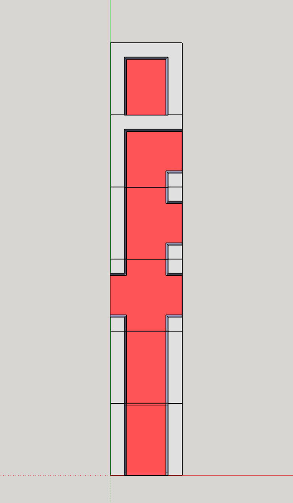
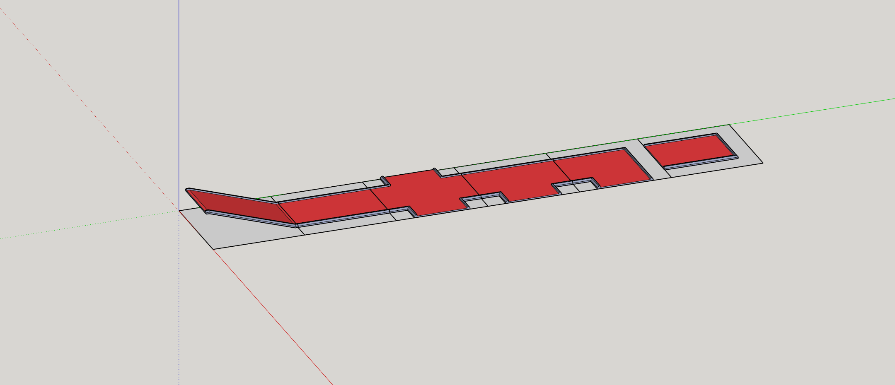

# Labyrinthia

A procedurally generated 3D maze for Decentraland, built with SDK7.

Every time the scene loads, a fresh maze is grown from a small set of modular tile pieces — corridors, forks, crossings, and multi‑level ramps that stack into a labyrinth spanning 10×10 parcels (160m × 160m).

**Live:** [labyrinthia.dcl.eth](https://play.decentraland.org/?realm=labyrinthia.dcl.eth)

This project is intended to be **downloaded, remixed, and shared**. All source assets (Blender, SketchUp) are included alongside the exported `.glb` tiles so you can swap in your own geometry and generate entirely new worlds from the same rule set.

---

## Design references

| Plan view | Axonometric |
|---|---|
|  |  |

---

## How it works

### The tile catalog

Six modular tiles, each defined by a set of open edges in a canonical orientation (N/E/S/W). The generator considers all 4 rotations of each tile at every cell.

| Tile | Openings | Purpose |
|---|---|---|
| `end` | N | Seed / cap for dead ends |
| `straight` | N, S | Corridor |
| `turn` | N, E | 90° corner |
| `fork` | N, S, W | T‑junction |
| `cross` | N, E, S, W | 4‑way intersection |
| `ramp` | N, S | Two‑level connector (S is low, N is high) |

Source models live in [`assets/models/`](assets/models/) as `.glb` files. Original modeling files:

- [`assets/blender/tiles.blend`](assets/blender/) — Blender source
- [`assets/sketchup/tiles.skp`](assets/sketchup/) — SketchUp source

### Generation algorithm

Maze growth is a frontier‑based flood‑fill with vertical stacking:

1. **Seed** — about 1 seed per 25 parcels are dropped as `end` tiles at random cells on the ground level.
2. **Grow** — the open edges of placed tiles feed a frontier queue. Cells are consumed lowest‑Y first (so each floor fills horizontally before ramps climb).
3. **Pick a tile** — a weighted pool favours branching/ramp tiles (`ramp ×3, cross ×2, fork ×2, turn, straight`), falling back to `end` only when nothing else fits.
4. **Validate placement** — each candidate must pass strict connectivity checks: openings can't face off‑grid or into a wall, ramps can't collide vertically, and multi‑level ramp interactions must "handshake" correctly (see [`canPlace()`](src/index.ts) for the full ruleset).
5. **Validate result** — after growth, every opening on every placed tile must connect to a matching neighbour. If any dangle, discard and retry with a new seed (up to 500 attempts).

Ramps are the tricky part. Because a ramp's high side lands one level up in an adjacent cell, they interact with neighbours on multiple Y levels simultaneously. The generator enforces several rules to keep stairs walkable:

- Cells directly above a ramp must be empty or another ramp of the **same rotation**.
- Parallel same‑axis ramps on different levels must climb in the **same direction** (no fragile "V" configurations).
- When two orthogonally‑adjacent ramps interact, either their rotations match (matched handshake) or they meet edge‑to‑edge at their shared high edges.

Generation is deterministic given a seed: the RNG is a small mulberry32, and the winning seed is logged to the browser console on each generation so any bug can be reproduced exactly.

---

## Remix guide

The whole generator is a single file: [`src/index.ts`](src/index.ts). Common tweaks:

| Want to… | Change |
|---|---|
| Use bigger/smaller tiles | `TILE_SCALE` (currently `2`) |
| Change ramp step height | `STEP` (derived from `TILE_SCALE`) |
| Bias the tile mix | `GROWTH_PRIMARY` weighted array |
| More/fewer seed points | `SEED_COUNT` formula in `generate()` |
| Cap tower height | `MAX_Y` |
| Lock a specific maze | Set `startSeed` in `main()` to a known‑good number |
| Swap the geometry | Replace files in `assets/models/` (keep the same names & pivot at SW corner) |

Tile pivots are at the south‑west corner with geometry extending `+X` / `+Z`. If you author replacements with a centred pivot you'll need to adjust `ROT_OFFSET` in `src/index.ts`.

---

## Run locally

```bash
npm install
npm start
```

Preview opens in your browser via the Decentraland SDK dev server.

## Deploy

Scene is configured as a Decentraland World in [`scene.json`](scene.json) (`worldConfiguration.name: "labyrinthia.dcl.eth"`).

```bash
npm run deploy -- --target-content https://worlds-content-server.decentraland.org
```

To deploy to your own World, change `worldConfiguration.name` to a DCL NAME or ENS you own.

---

## Project structure

```
maze/
├── assets/
│   ├── blender/       # Blender source (.blend)
│   ├── sketchup/      # SketchUp source (.skp)
│   ├── images/        # Design reference art
│   ├── models/        # Exported .glb tiles used by the scene
│   └── scene/         # Creator Hub composite
├── src/
│   ├── index.ts       # Generator + scene entry point
│   └── ui.tsx         # Hint banner UI
├── scene.json         # Parcels, spawn points, world config
└── package.json
```

---

## License

MIT — do whatever you like, credit appreciated but not required. Have fun remixing.
